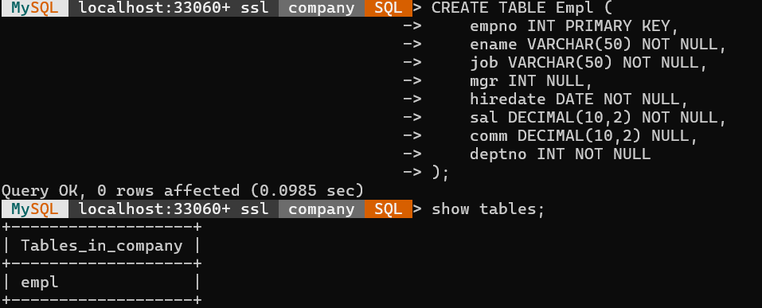
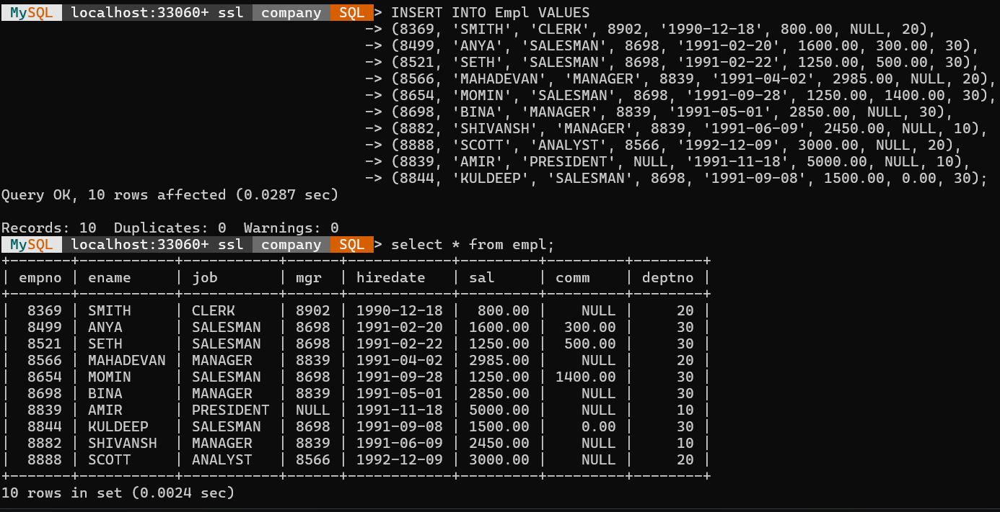
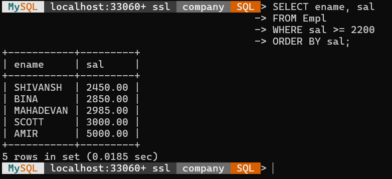
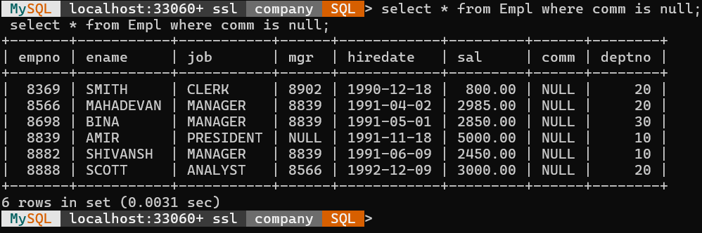
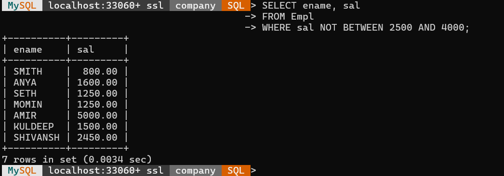
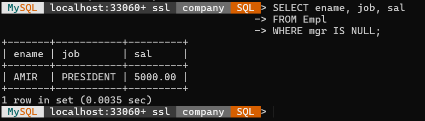
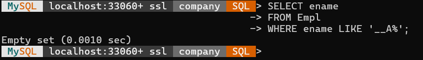
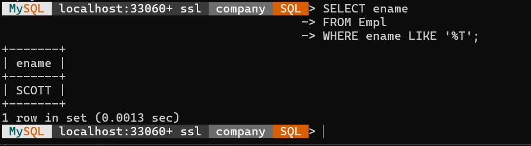
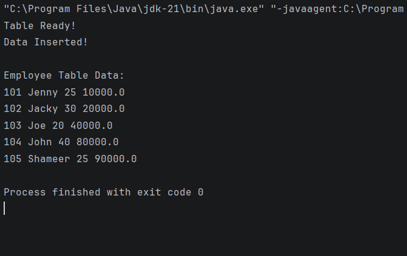

# Java Full Stack - Task 09
## MySQL + JDBC Assignment


---
# 🗄️ MYSQL TASK

---
## Complete Query
👉 [MySQL Queries](./sql_queries.sql)

---
## ✅ Table Creation

### Query
```sql
CREATE TABLE Empl (
    empno INT PRIMARY KEY,
    ename VARCHAR(50) NOT NULL,
    job VARCHAR(50) NOT NULL,
    mgr INT NULL,
    hiredate DATE NOT NULL,
    sal DECIMAL(10,2) NOT NULL,
    comm DECIMAL(10,2) NULL,
    deptno INT NOT NULL
);

```
### Output


---

## ✅ Value Insertion

### Query
```sql
INSERT INTO Empl VALUES
                     (8369, 'SMITH', 'CLERK', 8902, '1990-12-18', 800.00, NULL, 20),
                     (8499, 'ANYA', 'SALESMAN', 8698, '1991-02-20', 1600.00, 300.00, 30),
                     (8521, 'SETH', 'SALESMAN', 8698, '1991-02-22', 1250.00, 500.00, 30),
                     (8566, 'MAHADEVAN', 'MANAGER', 8839, '1991-04-02', 2985.00, NULL, 20),
                     (8654, 'MOMIN', 'SALESMAN', 8698, '1991-09-28', 1250.00, 1400.00, 30),
                     (8698, 'BINA', 'MANAGER', 8839, '1991-05-01', 2850.00, NULL, 30),
                     (8882, 'SHIVANSH', 'MANAGER', 8839, '1991-06-09', 2450.00, NULL, 10),
                     (8888, 'SCOTT', 'ANALYST', 8566, '1992-12-09', 3000.00, NULL, 20),
                     (8839, 'AMIR', 'PRESIDENT', NULL, '1991-11-18', 5000.00, NULL, 10),
                     (8844, 'KULDEEP', 'SALESMAN', 8698, '1991-09-08', 1500.00, 0.00, 30);

```

```sql
select * from empl;
```
### Output


---
## 🧾 Query Solutions

---
### Question 1A

ENAME AND SAL WHERE SAL >= 2200

### Query

```sql
SELECT ename, sal
FROM Empl
WHERE sal >= 2200;

```
### Output


---
### Question 1B

EMPLOYEES NOT GETTING COMMISSION

### Query

```sql
SELECT *
FROM Empl
WHERE comm IS NULL;
```
### Output


---
### Question 1C

SALARY NOT BETWEEN 2500 AND 4000

### Query

```sql
SELECT ename, sal
FROM Empl
WHERE sal NOT BETWEEN 2500 AND 4000;
```
### Output


---
### Question 1D

EMPLOYEES WITHOUT MANAGER

### Query

```sql
SELECT ename, job, sal
FROM Empl
WHERE mgr IS NULL;
```
### Output


---
### Question 1E

EMPLOYEE NAME HAVING 'A' AS THIRD LETTER

### Query

```sql
SELECT ename
FROM Empl
WHERE ename LIKE '__A%';
```
### Output


---
### Question 1F

EMPLOYEE NAME ENDING WITH 'T'

### Query

```sql
SELECT ename
FROM Empl
WHERE ename LIKE '%T';
```
### Output


---
# ☕ JDBC TASK

## ✅ JDBC Table Creation + Data Insert + Display

### Output


---