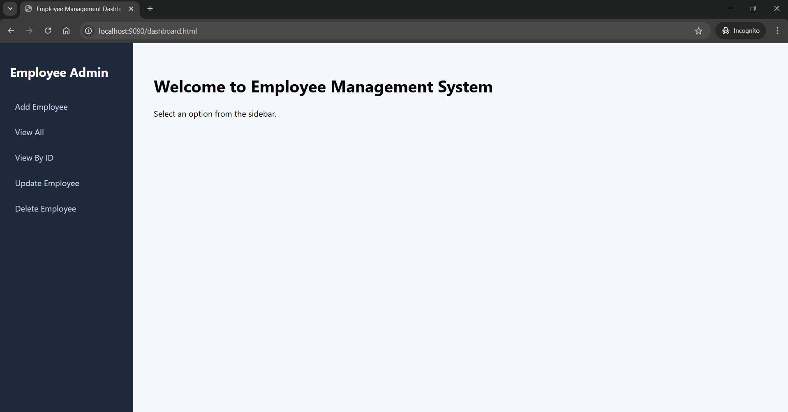
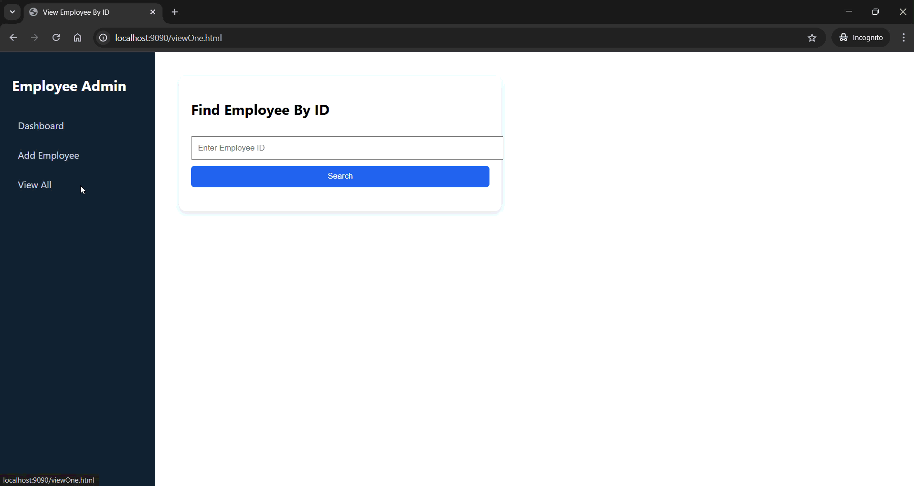

# Employee Management System

## 📌 Problem Statement

Build a full-stack Employee Management System using:

- Spring Boot
- MongoDB Atlas
- RESTful APIs
- HTML/CSS Frontend

The system must support:

- Create Employee
- Fetch All Employees
- Fetch Employee by ID
- Update Employee by ID
- Delete Employee by ID

---

## 🏗 Solution Overview

This project implements a layered Spring Boot architecture:

Controller → Service → Repository → MongoDB

The frontend communicates using REST APIs via Fetch API.

All CRUD operations are implemented with proper HTTP status handling (200, 404).

---

## 🚀 Feature Demonstrations

### 1️⃣ Home Page

Home Page

---

### 1️⃣ Add Employee

Adds a new employee into MongoDB Atlas.

---

### 2️⃣ View All Employees

Displays all employees stored in the database.

---

### 3️⃣ Fetch Employee By ID

Fetches a specific employee using ID.

---

### 4️⃣ Update Employee

Updates employee details by ID.

---

### 5️⃣ Delete Employee

Deletes employee by ID with proper 404 handling.

---

## 🏗 Architecture

This project follows layered architecture:

Controller → Service → Repository → MongoDB

- Controller handles HTTP requests
- Service contains business logic
- Repository interacts with MongoDB
- Frontend communicates via REST APIs

---

## 📌 Features

- Add Employee
- View All Employees
- View Employee by ID
- Update Employee by ID
- Delete Employee by ID
- Toast notifications

---

## 🔗 REST API Endpoints

| Method | Endpoint | Description |
|--------|----------|-------------|
| POST | /employees | Create employee |
| GET | /employees/displayAll | Fetch all employees |
| GET | /employees/display/{id} | Fetch employee by ID |
| PUT | /employees/update/{id} | Update employee |
| DELETE | /employees/delete/{id} | Delete employee |

---

## ⚙️ Tech Stack

Backend:
- Java 21
- Spring Boot
- Spring MVC
- Spring Data MongoDB
- MongoDB Atlas

Frontend:
- HTML5
- CSS3 (Admin Dashboard UI)
- JavaScript (Fetch API)

---

## 🛠 Setup Instructions

1. Clone the repository
2. Configure MongoDB Atlas URI
3. Set environment variables:
   - MONGO_USER
   - MONGO_PASS
4. Run Spring Boot application
5. Open:
   http://localhost:9090/dashboard.html