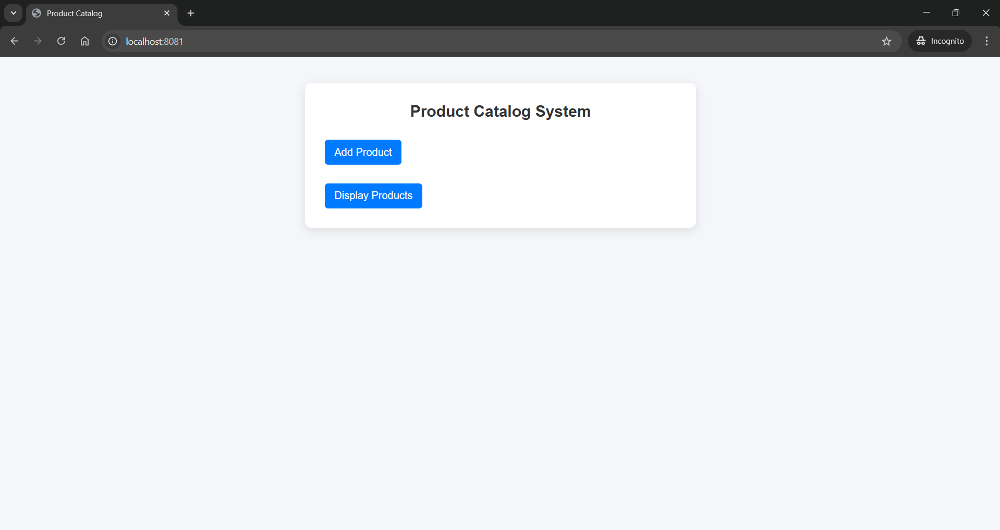
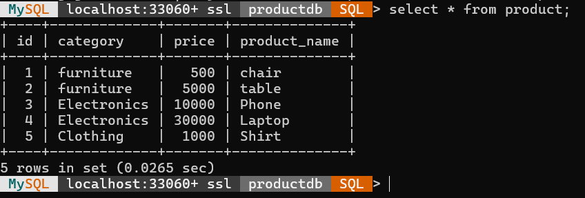
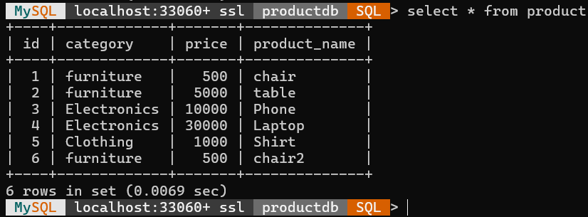

# Question 1: Product Catalog System

## Overview
This is a Spring Boot web application designed to manage a product catalog. It fulfills the assignment requirements by allowing users to add new products and view the entire product catalog in a structured format. The project follows a standard MVC architecture, connecting a Thymeleaf-based frontend to a MySQL database using Spring Data JPA.

## Technologies Used
* **Backend:** Java, Spring Boot, Spring MVC, Spring Data JPA
* **Frontend:** HTML5, CSS3, Thymeleaf
* **Database:** MySQL
* **Build Tool:** Maven

## Architecture & Implementation Details
* **Entity (`Product.java`):** Represents the database table with attributes for `id`, `productName`, `price`, and `category`.
* **Repository (`ProductRepository.java`):** Extends `JpaRepository` for standard CRUD operations and implements a custom `findByCategory` method.
* **Service (`ProductService.java`):** Encapsulates the business logic, acting as a bridge between the Controller and the Repository.
* **Controller (`ProductController.java`):** Handles HTTP routing, processes user inputs from the web forms, and returns the appropriate Thymeleaf views.

## Application Endpoints

| HTTP Method | Endpoint | Description |
| :--- | :--- | :--- |
| **GET** | `/` | Renders the home page presenting options to either add or display products. |
| **GET** | `/add` | Displays the HTML form (`add-product.html`) to input new product details. |
| **POST**| `/save` | Captures form submission, saves the product to the database, and redirects to the display page. |
| **GET** | `/display` | Retrieves all stored products and renders them in a tabular format (`display-products.html`). |
| **GET** | `/filter` | Filters the displayed products based on a user-submitted category string. |

## How to Run
1. Ensure MySQL is running on your system.
2. Create a new database named `productdb`.
3. Verify your database credentials (`spring.datasource.username` and `password`) in `application.properties`.
4. Run the Spring Boot application. It will start on `server.port=8081`.
5. Open your browser and navigate to: `http://localhost:8081/`

---

## Output Screenshots

### Web Application Interfaces

### Home Page

### Add Product

### Display Product With Filter Option

---

### Database View

### Database(Before Adding Product)

### Database(After Adding Product)

---

> 👈 [Back to Main README](../README.md)