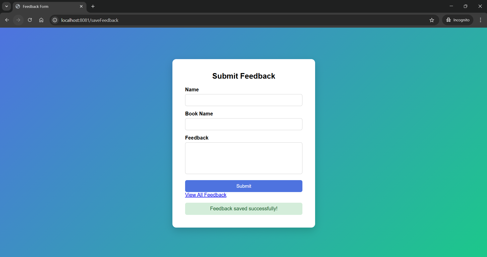
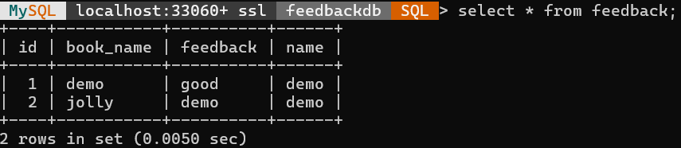
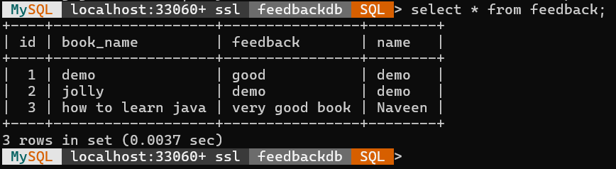

# Question 2: Spring Boot & Spring MVC – Feedback Application

## Overview
This is a Spring Boot web application that allows users to submit feedback for books through a web form. The application stores the submitted data in a MySQL database and displays a success message ("Feedback saved successfully!") upon submission. Users can also view a list of all submitted feedback.

## Technologies Used
* **Backend:** Java, Spring Boot, Spring MVC, Spring Data JPA
* **Frontend:** HTML5, CSS3, Thymeleaf
* **Database:** MySQL
* **Build Tool:** Maven

## Architecture & Implementation Details
* **Entity (`Feedback.java`):** Maps to the database table with fields for `id`, `name`, `bookName`, and `feedback`.
* **Repository (`FeedbackRepository.java`):** Extends `JpaRepository` to handle database operations (saving and retrieving feedback) without writing boilerplate SQL.
* **Controller (`FeedbackController.java`):** Uses `@Controller` to manage HTTP requests, bind form data to the `Feedback` entity, and handle view routing.
* **Styling (`style.css`):** Provides a clean, modern UI with a gradient background and responsive form containers.

## Application Endpoints

| HTTP Method | Endpoint | Description |
| :--- | :--- | :--- |
| **GET** | `/feedback` | Displays the main feedback form (`feedback-form.html`). |
| **POST**| `/saveFeedback` | Handles form submission, persists data to MySQL, and reloads the form with a success message. |
| **GET** | `/viewFeedback` | Retrieves all stored feedback from the database and displays it in a table (`view-feedback.html`). |

## How to Run
1. Ensure MySQL is running locally.
2. Create a new database named `feedbackdb` in your MySQL server.
3. The application is configured to use the default credentials (`root` / `root`). Update `application.properties` if your local setup differs.
4. Run the Spring Boot application. It is configured to start on `server.port=8081`.
5. Open your browser and navigate to: `http://localhost:8081/feedback`

---

## Output Screenshots

### Web Application Interfaces

### Feedback Submit Form

### Success Confirmation Page

### View All Feedback

---

### Database View

### Database(Before Adding Product)

### Database(After Adding Product)

---

> 👈 [Back to Main README](../README.md)